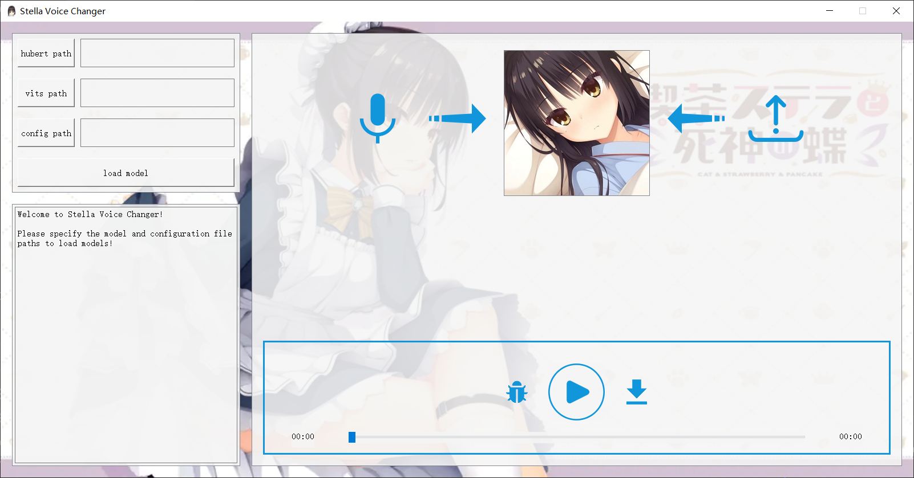
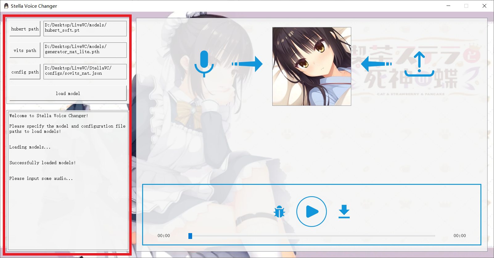
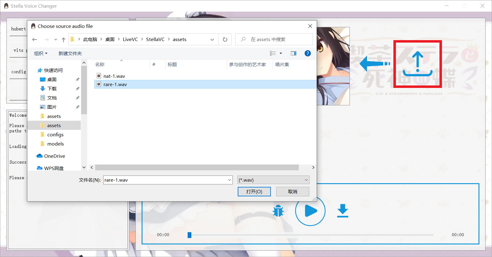
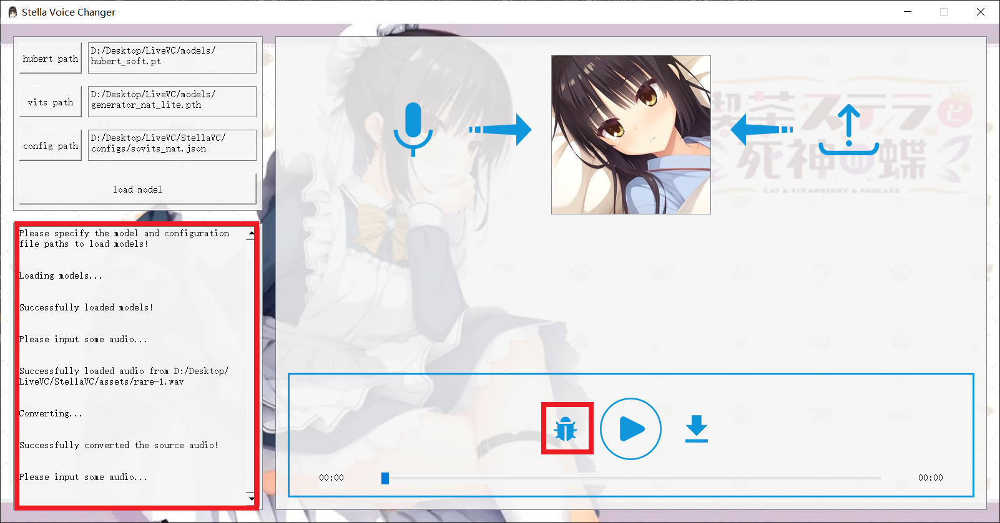

# Stella Voice Changer

[English](README.md) | [中文](README-zh.md)

## Introduction

Stella Voice Changer is an easy-to-use application with GUI for deep-learning-based voice conversion inference on local machines. Now it supports record mode CPU inference, tested on Windows 10 and Windows 11.

## How to Use

The GUI is like the following. It consists of three parts: configuration frame, information frame and main frame. 

### Step 1: Load Models

First, make sure you have downloaded the pretrained models and corresponding configuration files to your local machines. They are all provided [here](https://github.com/Francis-Komizu/StellaVC-ModelList).

Click the `hubert path`, `vits path` and `config path` button to select models and configuration path on your local machines. 

Then, just click the `load model` button. If successful, you should see the following messages on the information frame.

### Step 2: Load Audio

In this step, your will need to load the audio you want to convert to the model. You can upload an existing file or turn on the microphone to record one.

To upload an existing file, just click the `upload button`. Be careful that you can only upload a `wav` file!

To record an audio clip, just click the `record button` (not supported yet).

### Step 3: Convert Voice

If everything is in order, just click the `convert button`!

When conversion is over, you can play the generated audio and download it.

## Contact

QQ: 2235306122

BILIBILI: [Francis-Komizu](https://space.bilibili.com/636704927?spm_id_from=333.1007.0.0)

## References

[iconfont-阿里巴巴矢量图标库](https://www.iconfont.cn/)

